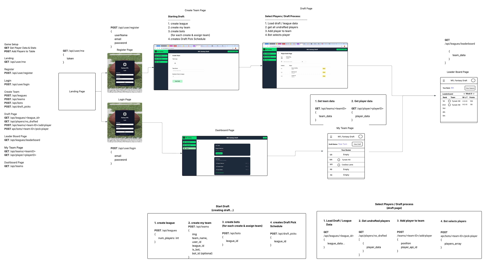
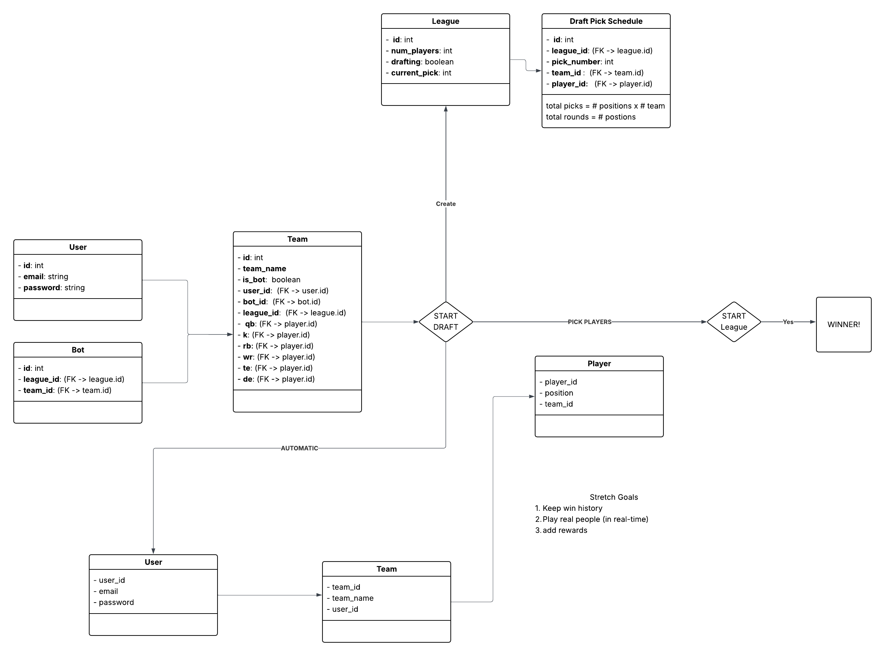

# NFL Fantasy Draft Game

### Team name: FullStack Tech Champs

### Project Roles

- Front-end: Dharun, Ayotunde
- Back-end: Cesaire
- DevOps: Mark

## Project Description

For project 2 here at Revature, we created an NFL fantasy football game app where the user plays against a bot that uses the Open AI API to choose its players. Users can create a team of real life athletes using data from a fantasy sports API. Each team is then ranked based on how well their players perform on the field. The team with the highest standing for that season wins. The backend is a Java Spring Boot application that utilizes Spring Data JPA, JWT for authentication and Mockito for testing. The frontend is a Vite React Typescript application that utilizes ShadCN components and Tailwind CSS for styling. The data for athletes on each team is stored in an AWS RDS PostreSQL database instance. For deployment, this project utilizes Jenkins CI/CD pipelines and an AWS EC2 instance, which runs the Docker images that are created in the Jenkins pipelines.

## MVP user stories

User Story 1: Football season is over, a User is bored and wants to play a game. The User head over to the NflfantasyDraftGame web app and Sign up with email and password.

User can Create a team with up to 5 players and min 2 players (the computer creates an open AI API userBot), and the open API uses LLM to choose players based on strategy and difficulty.

User can draft athletes to their team.

User plays a game against the computer by Starting the draft, where every team gets 5 picks.

At the end of the Draft, the user heads to the leaderboard page finds out who the winner is.

Goal of the game is to win, have fun and increase fantasy football knowlege so Users can be ready for a real draft come this fall 2025 Football season.

## External API you're using

We'll be using the NFL API from SportsDataIO, and the Open AI API

## ERD

## ERD

- Users table: username, password, role
- Teams: team_id, name, qb_id, kicker_id, running_back_id, tide_end_id, wide_receiver_id
- Player (real life athletes)
